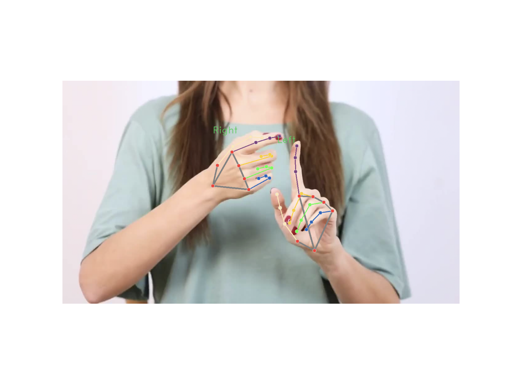
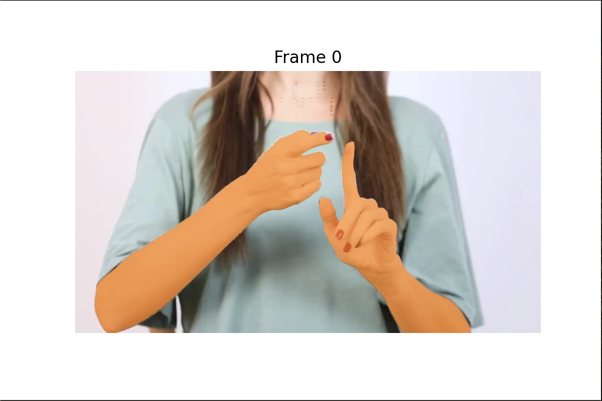
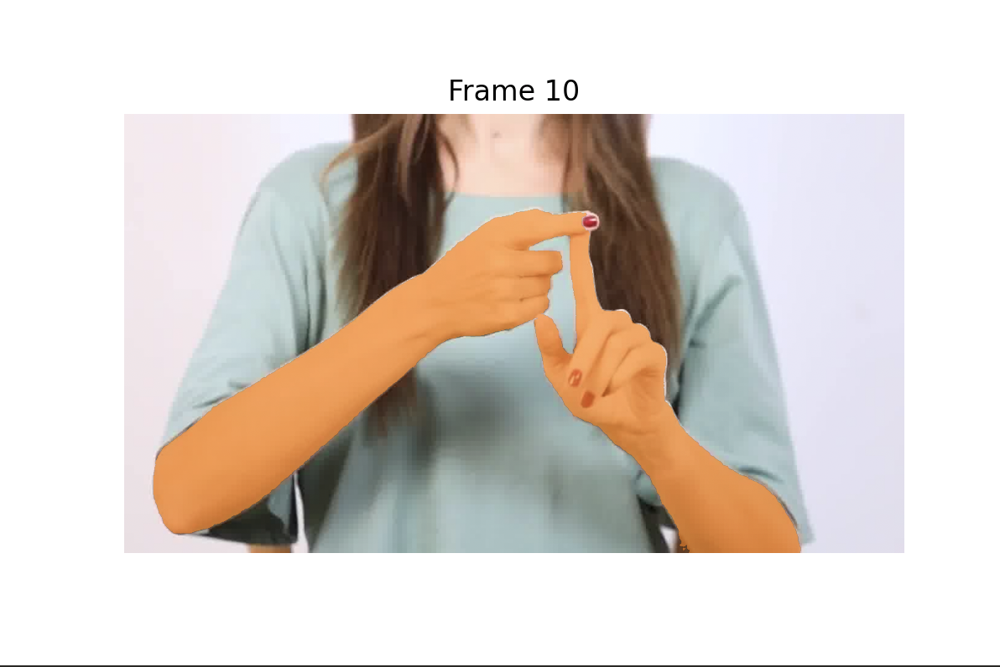
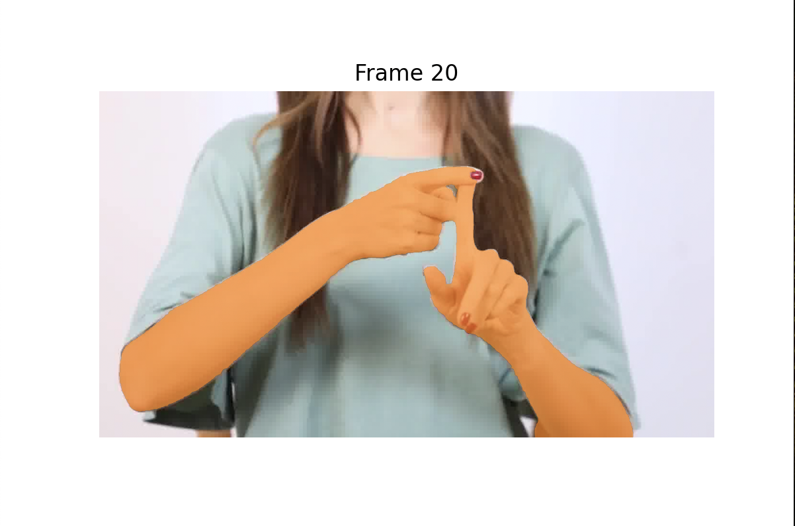
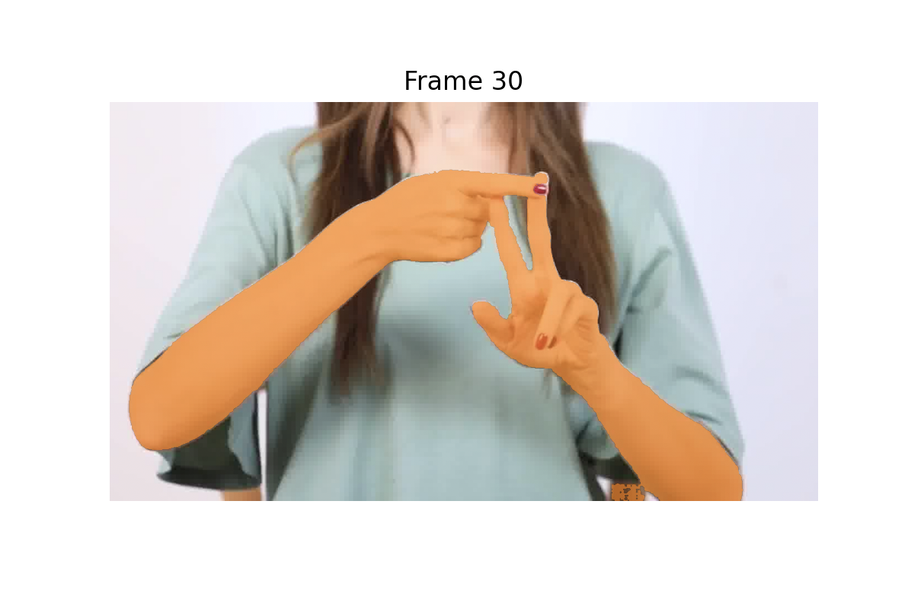
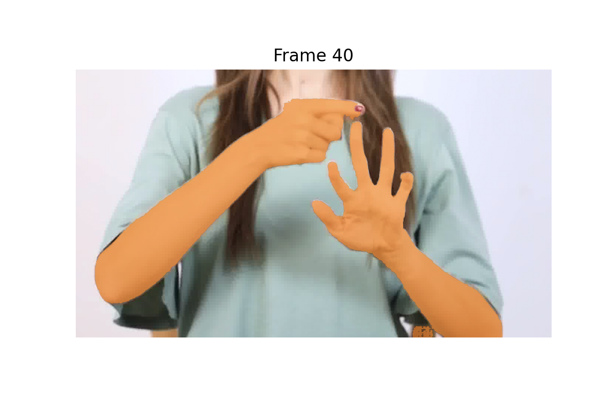
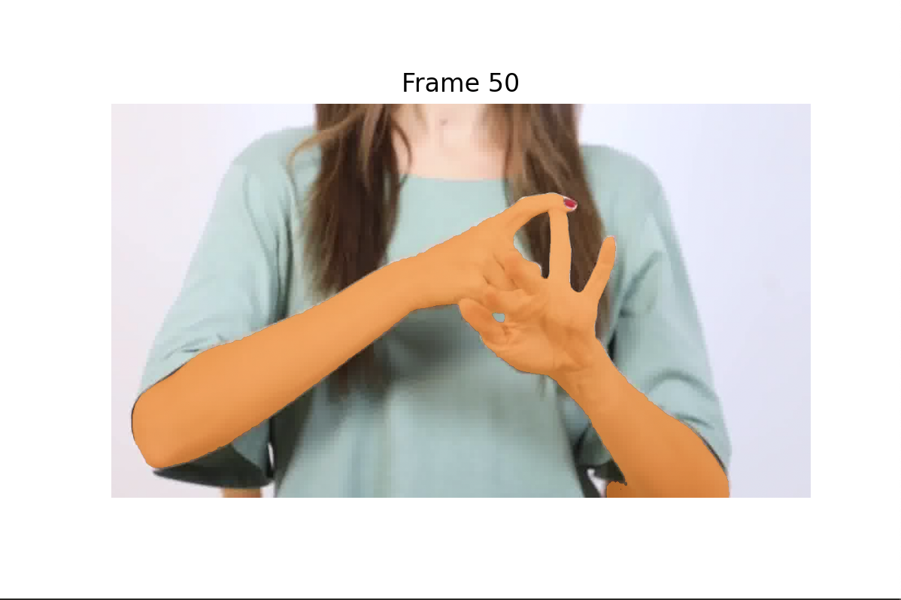
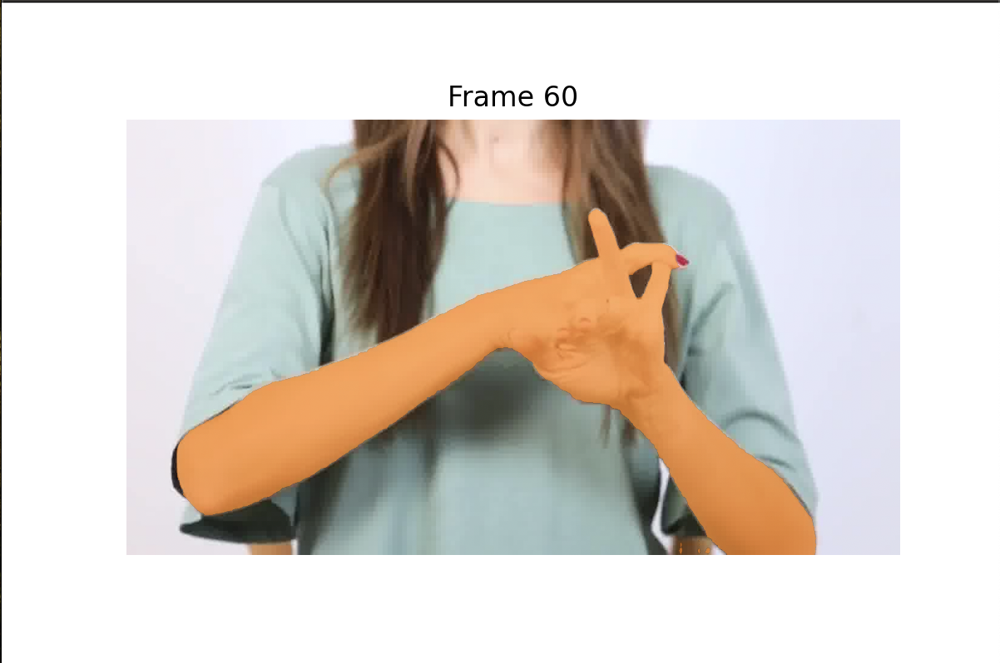
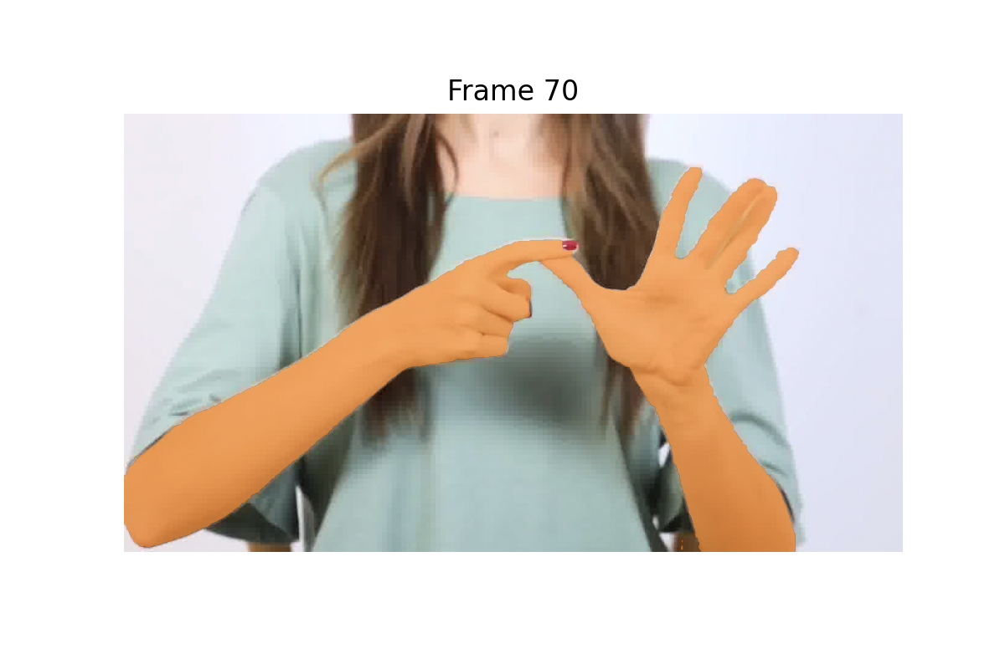

# Hand-Tracker

## Environment Setup

1. Navigate to the directory containing your Conda environment profile:
   
bash
   cd /Users/sidharthjain/miniforge3/etc/profile.d

2. Activate the Conda environment:
   
bash
   conda activate sam2

3. Install all required Python modules as specified in the accompanying documentation. Additionally, ensure the following are installed:
   - matplotlib
   - sam2

4. Install checkpoints for sam2:
   
bash
   cd checkpoints && \
   ./download_ckpts.sh && \
   cd ..

## Overview

This project provides functionality to process images and videos for hand detection and segmentation using sam2 and MediaPipe’s Hand Landmarker task. It outputs results in sam2-readable prompts, such as points, bounding boxes, and masks.

### Key Features:
1. Hand detection and visualization for images.
2. Frame-wise hand segmentation for videos.
3. Integration of hand landmark detection with negative indicators to filter out arms, focusing solely on hands.

---

## Workflow

### Image Processing

1. **Load the Hand Landmarker Model**:
   Use MediaPipe's Hand Landmarker task to detect and annotate hand landmarks on images.

2. **Visualization**:
   - Annotate the image with landmarks and handedness (left/right hand).
   - Store hand coordinates for further processing.

### Video Processing

1. **Convert Video to Frames**:
   - Use ffmpeg to split the video into individual frames for analysis.

2. **Hand Segmentation**:
   - Use sam2 to generate masks for hands in all frames.
   - Train the model using points derived from the original image.

3. **Negative Indicators**:
   - Filter out arm regions to ensure only hands are segmented.

---

## Required Modules

The following Python libraries are required:

python
import numpy as np
import matplotlib.pyplot as plt
import cv2
import mediapipe as mp
from mediapipe.framework.formats import landmark_pb2
from mediapipe import solutions
from mediapipe.tasks import python
from mediapipe.tasks.python import vision
from PIL import Image
from sam2.build_sam import build_sam2_video_predictor
import os

---

## Constants

python
MARGIN = 10
FONT_SIZE = 1
FONT_THICKNESS = 1
HANDEDNESS_TEXT_COLOR = (88, 205, 54)  # Vibrant green
ALL_COORDINATES = []
np.random.seed(43)

---

## Code Overview

### Functions

#### draw_landmarks_on_image
Draws hand landmarks and annotates handedness on the image. Coordinates are stored globally for further processing.

#### show_mask, show_points, show_box
Helper functions to visualize masks, points, and bounding boxes on images.

#### process_image
1. Loads an input image.
2. Detects hand landmarks using the MediaPipe Hand Landmarker.
3. Annotates the image with detected landmarks and handedness.

#### process_video
1. Initializes the sam2 video predictor.
2. Processes video frames to detect and propagate hand masks.
3. Visualizes segmentation results at regular frame intervals.

---

## Execution

### Example Commands

#### Process an Image
python
IMAGE_PATH = "images/1.jpg"
MODEL_PATH = "hand_landmarker.task"
process_image(IMAGE_PATH, MODEL_PATH)

#### Process a Video
python
VIDEO_DIR = "images"
SAM2_CHECKPOINT = "checkpoints/sam2.1_hiera_tiny.pt"
MODEL_CFG = "configs/sam2.1/sam2.1_hiera_t.yaml"
process_video(VIDEO_DIR, MODEL_CFG, SAM2_CHECKPOINT)

---

## Tools

### Dependencies
- MediaPipe Hand Landmarker: [Download Hand Landmarker Task](https://mediapipe.dev/)
- FFmpeg: For video-to-frame conversion.

### Usage Notes
- Ensure all checkpoints are downloaded and stored in the correct directory (checkpoints).
- Preprocess videos into frames using FFmpeg:
  
bash
  ffmpeg -i input_video.mp4 images/frame_%04d.jpg

- Update model paths and configurations in the script as necessary.

---
1. **Initial Image:**
   

2. **Processed Output Images:**
   - 
   - 
   - 
   - 
   - 
   - 
   - 
   - 

## Improvements

1. Introduce negative indicators to remove arm segments from masks, ensuring only hands are detected.
2. Optimize mask generation and frame processing for larger videos.

---

## Future Work

1. Enhance detection accuracy by refining model training with diverse datasets.
2. Integrate real-time hand tracking for video streams.
3. Extend functionality for multi-hand detection scenarios.

---
 want to add output images that are in the output  folder, the first image is called initial.png reast are called output1.png output10.png and till output70.png
